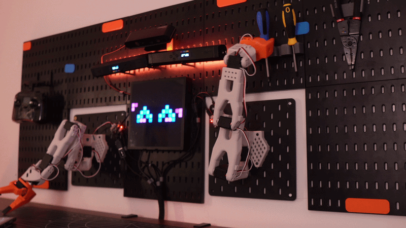

<div align="center">

```
 ██████╗ ██╗   ██╗██████╗ ██╗████████╗
██╔═══██╗██║   ██║██╔══██╗██║╚══██╔══╝
██║   ██║██║   ██║██████╔╝██║   ██║   
██║▄▄ ██║██║   ██║██╔══██╗██║   ██║   
╚██████╔╝╚██████╔╝██████╔╝██║   ██║   
 ╚══▀▀═╝  ╚═════╝ ╚═════╝ ╚═╝   ╚═╝  
```

**dual-arm desk robot · expressive LED eyes · open-source Python brain**

[](https://twitter.com/0xaiwhisperer)
[](https://www.raspberrypi.com/)
[](LICENSE)
[](#)

</div>

---


---

## what is qubit?

Qubit is a fully functional **dual-arm desktop robot** built for demos, livestreams, and content creation. Two SO-100 arms. Expressive 16×16 LED eyes. Ambient RGB lighting. A Raspberry Pi brain. And a Python codebase that makes it all scriptable, remixable, and yours.

This isn't a toy — it's a platform. Bimanual manipulation, teleoperation, computer vision, idle animations, a web dashboard — all open source, all hackable.

> *machines, memes, and magic* — [@0xaiwhisperer](https://twitter.com/0xaiwhisperer)

---

## in action

<table>
  <tr>
    <td align="center" width="50%">
      <br/>
      <sub><b>precision pick & place</b> — screwdriver grab sequence</sub>
    </td>
    <td align="center" width="50%">
      <br/>
      <sub><b>robot dance</b> — synchronized bimanual choreography</sub>
    </td>
  </tr>
</table>

---

## capabilities

| feature | details |
|---|---|
| 🦾 **bimanual arms** | 2× SO-100 arms · 12× STS3215 servos · independent control |
| 👁️ **expressive face** | 16×16 iDotMatrix LED · 14 included emotes · fully custom |
| 💡 **ambient lighting** | dual WS2812B LED tubes · full RGB · programmable effects |
| 🧠 **Pi 5 brain** | Raspberry Pi 5 · Python 3.10+ · modular script library |
| 🎮 **teleoperation** | leader/follower arm pairing via LeRobot |
| 📷 **camera vision** | face tracking · Pi Camera Module v3 |
| 🌐 **web dashboard** | local control UI at `qubit.local:5000` |

---

## 📋 table of contents

- [Hardware & BOM](#hardware)
- [3D Printing](#3d-printing)
- [Software Setup](#software-setup)
- [Python Scripts](#python-scripts)
- [Emotes & LED Animations](#emotes--led-animations)
- [Project Structure](#project-structure)
- [Troubleshooting](#troubleshooting)
- [Contributing](#contributing)

---

## hardware

### bill of materials — per SO-100 arm

> Each Qubit uses **2× SO-100 arms** — multiply arm quantities by 2. The optional SO-101 leader arm (teleoperation) needs 6× STS3215 in a specific mix: 3× C046, 2× C044, 1× C001 — available as a bundle on Alibaba.

| part | qty | 🇺🇸 USD | 🇺🇸 link | 🇪🇺 EUR | 🇪🇺 link | 🇨🇳 RMB | 🇨🇳 link |
|---|:---:|---:|---|---:|---|---:|---|
| STS3215 Servo (C001, 1/345 gear) | 6 | $14 | [Alibaba](https://www.alibaba.com/product-detail/Top-Seller-Low-Cost-Feetech-STS3215_1600999461525.html) | €13 | [Alibaba](https://www.alibaba.com/product-detail/Top-Seller-Low-Cost-Feetech-STS3215_1600999461525.html) | ￥97.72 | [TaoBao](https://item.taobao.com/item.htm?id=712179366565) |
| Motor Control Board | 1 | $11 | [Amazon](https://www.amazon.com/Waveshare-Integrates-Control-Circuit-Supports/dp/B0CTMM4LWK/) | €12 | [Amazon](https://www.amazon.fr/-/en/dp/B0CJ6TP3TP/) | ￥27 | [TaoBao](https://detail.tmall.com/item.htm?id=738817173460) |
| USB-C Cable 2-pack | 1 | $7 | [Amazon](https://www.amazon.com/Charging-etguuds-Charger-Braided-Compatible/dp/B0B8NWLLW2/) | €7 | [Amazon](https://www.amazon.fr/dp/B07BNF842T/) | ￥23.90 | [TaoBao](https://detail.tmall.com/item.htm?id=44425281296) |
| Power Supply (7.5V DC) | 1 | $10 | [Amazon](https://www.amazon.com/Facmogu-Switching-Transformer-Compatible-5-5x2-1mm/dp/B087LY41PV/) | €13 | [Amazon](https://www.amazon.fr/-/en/dp/B01HRR9GY4/) | ￥22.31 | [TaoBao](https://item.taobao.com/item.htm?id=544824248494) |
| Table Clamp 2-pack | 1 | $5 | [Amazon](https://www.amazon.com/Mr-Pen-Carpenter-Clamp-6inch/dp/B092L925J4/) | €8 | [Amazon](https://www.amazon.fr/-/en/dp/B08HZ1QRBF/) | ￥7.80 | [TaoBao](https://detail.tmall.com/item.htm?id=738636473238) |
| Screwdriver Set | 1 | $6 | [Amazon](https://www.amazon.com/Precision-Phillips-Screwdriver-Electronics-Computer/dp/B0DB227RTH) | €10 | [Amazon](https://www.amazon.fr/dp/B08ZXVMVYD/) | ￥14.90 | [TaoBao](https://detail.tmall.com/item.htm?id=675684600845) |
| **per arm** | | **$123** | | **€128** | | **￥682** | |
| **2 arms total** | | **$246** | | **€256** | | **￥1,364** | |

> ⚠️ Verify gear ratios before ordering — the follower arm uses **all 1/345 (C001)**. Power supply must output **7.4–7.5V DC at 5A minimum** per arm.

---

### full system BOM

| component | notes | est. cost |
|---|---|---:|
| **Raspberry Pi 5** (4GB or 8GB) | main compute | ~$60–$80 |
| **16×16 LED Matrix** | iDotMatrix, BLE-controlled | ~$20–$35 |
| **LED Tubes** ×2 | WS2812B addressable RGB, 30–60cm | ~$15–$25 |
| **Bambu Lab A1** | prints all structural parts | ~$299 |
| **MicroSD Card** 32GB+ | Raspberry Pi OS | ~$10 |
| **Powered USB Hub** 4-port | connects both arm boards | ~$15 |
| **Pi Camera Module v3** | optional · face tracking | ~$25 |
| **5V/5A USB-C PSU** | for Raspberry Pi 5 | ~$12 |

> **💰 estimated full build (US):** ~$700–$800 depending on sourcing

---

### wiring diagram

```
┌─────────────────────────────────────────────────┐
│                  RASPBERRY PI 5                 │
│                                                 │
│  USB-A ──────────► Motor Board (Left Arm)       │
│  USB-A ──────────► Motor Board (Right Arm)      │
│  USB-C (power) ◄── 5V/5A Supply                │
│  GPIO / BLE ─────► 16×16 LED Matrix             │
│  GPIO PWM ───────► LED Tube Left (WS2812B)      │
│  GPIO PWM ───────► LED Tube Right (WS2812B)     │
│  CSI / USB ──────► Pi Camera (optional)         │
└─────────────────────────────────────────────────┘

Motor Board ×2 (one per arm)
  ├── USB-C ◄── 7.5V DC Power Supply (dedicated per arm)
  └── Serial bus ──► 6× STS3215 Servos (daisy-chained)
```

> ⚠️ **Never power servo boards from the Pi's USB ports.** Always use a dedicated supply to avoid brownouts and servo damage.

---

## 3D printing

All structural parts are designed for a **Bambu Lab A1** in PLA+ or PETG.

**recommended settings:**
- Layer height: `0.2mm`
- Infill: `40%` Gyroid
- Supports: required for arm joint brackets
- Print time per arm: ~8–12 hours

| file | description | material |
|---|---|---|
| `qubit_head_shell.stl` | main head enclosure · LED matrix housing | PLA+ |
| `qubit_head_back.stl` | rear panel with cable routing | PLA+ |
| `qubit_neck_bracket.stl` | neck-to-body mount | PETG |
| `qubit_body_frame.stl` | central torso · electronics mount | PETG |
| `qubit_led_tube_mount_left.stl` | left LED tube arm mount | PLA+ |
| `qubit_led_tube_mount_right.stl` | right LED tube arm mount | PLA+ |
| `qubit_arm_shoulder_left.stl` | left SO-100 shoulder attachment | PETG |
| `qubit_arm_shoulder_right.stl` | right SO-100 shoulder attachment | PETG |
| `qubit_base_plate.stl` | weighted desk base | PETG |
| `qubit_cable_cover.stl` | rear cable management cover | PLA+ |

> 💡 Print body frame and shoulder brackets in PETG — they take the most torque stress. PLA+ is fine for cosmetic shells.

---

## software setup

### prerequisites

- Raspberry Pi OS Bookworm 64-bit — [download](https://www.raspberrypi.com/software/)
- Python 3.10+
- Git

### installation

```bash
# clone
git clone https://github.com/0xaiwhisperer/qubit.git
cd qubit

# virtual environment
python3 -m venv .venv
source .venv/bin/activate

# dependencies
pip install -r requirements.txt

# optional: teleoperation support
pip install lerobot
```

### configuration

```bash
cp config/config.example.yaml config/config.yaml
nano config/config.yaml
```

```yaml
arms:
  left:
    port: /dev/ttyUSB0
    servo_ids: [1, 2, 3, 4, 5, 6]
  right:
    port: /dev/ttyUSB1
    servo_ids: [7, 8, 9, 10, 11, 12]

led_matrix:
  type: idotmatrix
  size: 16
  connection: bluetooth
  mac_address: "AA:BB:CC:DD:EE:FF"  # ← replace this

led_tubes:
  left_pin: 18
  right_pin: 19
  num_pixels: 30

camera:
  enabled: false
  device: 0
  resolution: [640, 480]
```

Find your serial ports: `ls /dev/ttyUSB*` — plug/unplug each arm to map them.

---

## python scripts

| script | description | usage |
|---|---|---|
| `run_arm.py` | manual servo control via keyboard or gamepad | `--arm left` |
| `teleop.py` | mirror leader arm → follower arm | — |
| `record_demo.py` | record arm movement sequence to JSON | `--arm left --output demos/wave.json` |
| `play_demo.py` | replay a recorded sequence | `--file demos/wave.json` |
| `calibrate.py` | interactive servo calibration wizard | `--arm left` |
| `led_matrix.py` | push emotes/animations to LED matrix | `--emote happy` |
| `led_tubes.py` | RGB tube lighting effects | `--mode pulse --color 00f5c4` |
| `face_track.py` | face tracking + arm movement via camera | — |
| `idle_behavior.py` | ambient idle animations | — |
| `diagnostics.py` | servo health · temps · load | `--arm all` |
| `dashboard.py` | local web control dashboard | → `qubit.local:5000` |

### example workflows

```bash
# autostart idle loop on boot
python /home/pi/qubit/scripts/idle_behavior.py &

# record and replay a wave
python scripts/record_demo.py --arm right --output demos/wave.json
# [ physically move the arm to record ]
python scripts/play_demo.py --file demos/wave.json --loop 3

# launch web dashboard
python scripts/dashboard.py
# → open http://qubit.local:5000
```

---

## emotes & LED animations

All emotes live in `/emotes` as JSON files — each describes a 16×16 pixel frame sequence for the LED matrix.

### emote format

```json
{
  "name": "happy",
  "fps": 8,
  "loop": true,
  "frames": [
    {
      "pixels": [
        [0,0,0, ...],  // row 0: 16 RGB values
        [0,0,0, ...],  // row 1
        ...            // rows 2–15
      ]
    }
  ]
}
```

### included emotes

| file | expression | animated |
|---|---|:---:|
| `happy.json` | 😊 happy eyes | ✅ |
| `blink.json` | 😐 slow blink | ✅ |
| `sad.json` | 😢 sad eyes | ✅ |
| `angry.json` | 😠 angry brow | ✅ |
| `surprised.json` | 😲 wide eyes | ✅ |
| `wink.json` | 😉 left eye wink | ✅ |
| `sleep.json` | 😴 closed eyes + zzz | ✅ |
| `loading.json` | 🔄 spinning loader | ✅ |
| `startup.json` | 💡 boot sequence flash | ✅ |
| `eye_track_left.json` | 👀 eyes shift left | ✅ |
| `eye_track_right.json` | 👀 eyes shift right | ✅ |
| `heart.json` | ❤️ heart pulse | ✅ |
| `glitch.json` | ⚡ glitch effect | ✅ |
| `off.json` | ⬛ all pixels off | — |

### playing emotes

```bash
# single emote
python scripts/led_matrix.py --emote happy

# sequence
python scripts/led_matrix.py --sequence startup,happy,blink

# loop indefinitely
python scripts/led_matrix.py --emote sleep --loop
```

> 💡 Use the built-in emote editor in the web dashboard, or preview locally with `python tools/emote_preview.py`

---

## project structure

```
qubit/
├── README.md
├── requirements.txt
├── config/
│   ├── config.example.yaml
│   └── config.yaml                  # local config (git-ignored)
├── scripts/                         # runnable scripts
│   ├── run_arm.py
│   ├── teleop.py
│   ├── record_demo.py
│   ├── play_demo.py
│   ├── calibrate.py
│   ├── led_matrix.py
│   ├── led_tubes.py
│   ├── face_track.py
│   ├── idle_behavior.py
│   ├── diagnostics.py
│   └── dashboard.py
├── emotes/                          # LED matrix animations (JSON)
│   └── *.json
├── stl/                             # 3D printable parts
│   └── *.stl
├── demos/                           # recorded arm sequences
│   ├── wave.json
│   └── idle_sway.json
├── qubit/                           # core Python library
│   ├── arm.py                       # SO-100 arm control
│   ├── servo.py                     # STS3215 serial bus driver
│   ├── led_matrix.py                # iDotMatrix driver
│   ├── led_tubes.py                 # WS2812B driver
│   ├── camera.py                    # camera + CV utilities
│   └── utils.py
├── tools/
│   ├── emote_preview.py
│   └── scan_servos.py
└── assets/
    ├── thumbnail.JPG
    ├── pickup_screwdriver.gif
    └── robot_dance.gif
```

---

## troubleshooting

**servos not responding**
- Check port assignment: `ls /dev/ttyUSB*`
- Verify power supply is 7.4–7.5V at 5A+ per arm
- Run `python scripts/diagnostics.py --arm all`
- Scan for servo IDs: `python tools/scan_servos.py`

**LED matrix not connecting**
- Enable Bluetooth: `sudo systemctl enable bluetooth`
- Pair first: `bluetoothctl` → `scan on` → `pair <MAC>`
- Verify MAC in `config.yaml`

**arm moving to wrong position**
- Recalibrate: `python scripts/calibrate.py --arm left`
- Check for mechanical binding (common with first-print tolerances)

**camera / face tracking not working**
- Install OpenCV: `pip install opencv-python-headless`
- Enable camera: `sudo raspi-config` → Interface Options → Camera

**low FPS in teleoperation**
- Lower servo polling: `teleop.hz: 50` in `config.yaml`
- Confirm Python 3.10+ and venv is active

---

## contributing

PRs welcome. For major changes, open an issue first.

```bash
git checkout -b feature/your-idea
# make your changes
git push origin feature/your-idea
# open a PR
```

**Custom emotes especially encouraged** — drop your `.json` files in `/emotes` and ship it.

---

<div align="center">

---

built by [**@0xaiwhisperer**](https://twitter.com/0xaiwhisperer)

*The A.I. Whisperer · machines, memes, and magic*

</div>